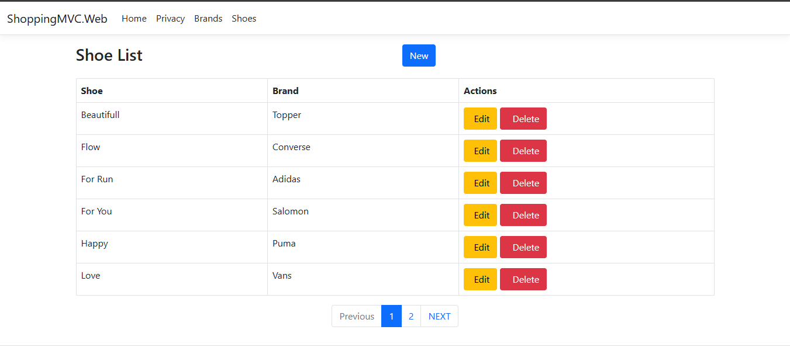

# Shoes & Brands - ASP.NET Core MVC (CRUD)

This project is a simple but complete ASP.NET Core MVC application that implements CRUD operations for **Brands** and **Shoes**, using a clean architecture approach with **Repository + Service**, **Entity Framework Core**, **AutoMapper**, and a Bootstrap UI.

It was built as a portfolio project to practice real MVC patterns, database relationships, view models, validation, and pagination.

---

## ✨ Features

### ✅ Brands Module (CRUD)
- Create, edit, list and delete brands
- Validation and duplicate record checks
- User-friendly messages

### ✅ Shoes Module (CRUD)
- Create, edit, list and delete shoes
- Shoes are linked to a Brand (FK relationship)
- Brand names are displayed using EF Core `Include`

### ✅ General
- Pagination in listing views
- Bootstrap UI (clean and readable)
- Server-side validation with Data Annotations
- Proper error handling (`NotFound`, `ModelState`, etc.)
- Repository pattern with optional filters and includes
- `AsNoTracking()` used for read-only queries

---

## 🧠 Tech Stack

- ASP.NET Core MVC
- Entity Framework Core
- SQL Server
- AutoMapper
- Bootstrap
- Repository Pattern + Service Layer
- PagedList (pagination)

---

## 🗂️ Project Structure (high level)

- **Controllers** → Handle HTTP requests and view flow  
- **Services** → Business logic and validations  
- **Repository** → Data access layer (EF Core)  
- **Entities/Models** → Database entities (Brand, Shoe)  
- **ViewModels** → Models used by the views (Edit/List)  
- **Mapping Profiles** → AutoMapper configuration  

---

## 🔍 Notes about EF Core (Include & AsNoTracking)

This project uses:

- `Include("Brand")` to load navigation properties and display Brand names in the Shoe list.
- `AsNoTracking()` for better performance on listing queries.

---

## ▶️ How to Run Locally

1. Clone the repository
2. Open the solution in Visual Studio
3. Update the SQL Server connection string in:
   - `appsettings.json`
4. Apply migrations:
   - `Update-Database`
5. Run the project (IIS Express or Kestrel)

---

## 📸 Screenshots

- Brands List  

 

- Shoes List (with Brand Name)  

 
- Shoe Create/Edit Form  

 

## 🚀 Future Improvements (planned)

- Stock management (by size and/or color)
- Authentication and roles (Admin/User)
- Search and filters
- REST API endpoints

---

## 👤 Author

**Romina Oviedo**  
Técnica en Análisis, Desarrollo y Programación de Aplicaciones 
Focused on building clean, maintainable software with both technical and human quality.

- LinkedIn: www.linkedin.com/in/romina-oviedo-1b24bb2a3
- GitHub: https://github.com/RomiOviedo/MVC-ShoesBrands-CRUD.git
